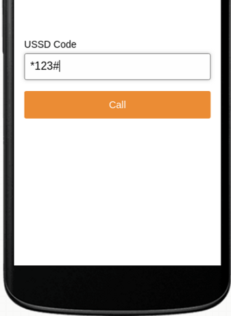
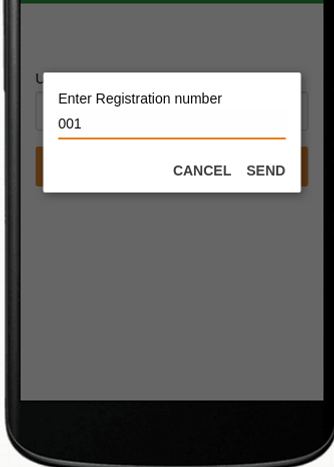
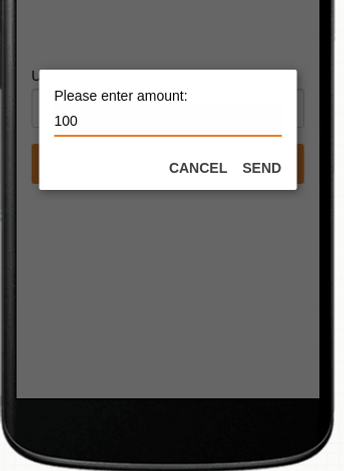
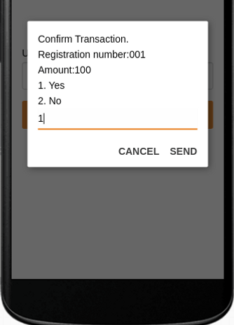
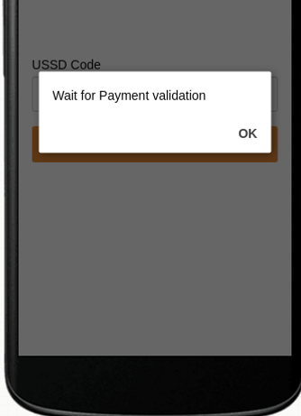
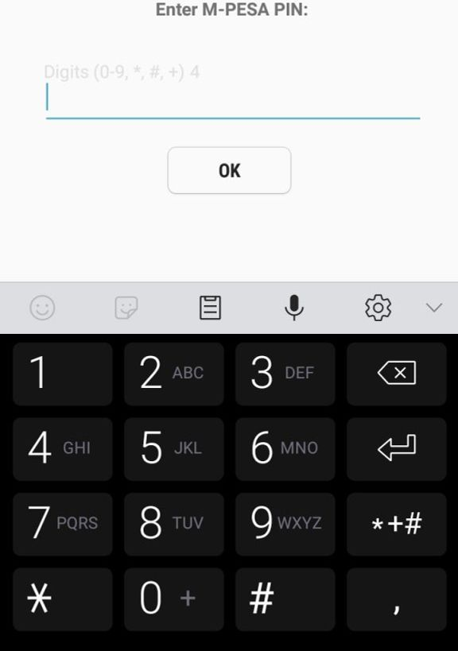

# Lipa

## Description

A USSD application used for making payments.

## Known Bugs

No known Bugs

## Technologies Used

- Python. Django. Africas Talking API. Safaricom M-pesa API

## Support and contact details

vincentmuya13@gmail.com
### License

Copyright (c) {2020} {Vincent Muya}
